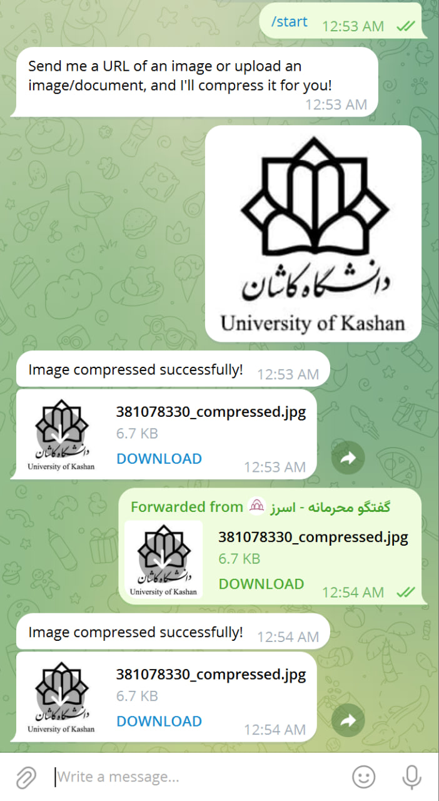

# Telegram Image Compressor Bot (telegram-image-compressor)

A Telegram bot that validates image URLs, downloads the pictures, compresses them, and shares the compressed picture back with the user.

## Features

- Validates user-submitted URLs to ensure they are valid and accessible.
- Checks if the URL returns a 200 HTTP status code (no 404 or invalid URLs).
- Retrieves file metadata, such as image size, without downloading the image.
- Downloads the image in the background.
- Compresses the image with efficient settings.
- Sends the compressed image back to the user as a downloadable file.



## Installation

1. Clone the repository:

   ```bash
   git clone https://github.com/basemax/telegram-image-compressor.git
   cd telegram-image-compressor
   ```

2. Install the required Python packages:

   ```bash
   pip install -r requirements.txt
   ```

4. Set up your bot token:

Obtain a bot token from **BotFather** on Telegram.

Replace `YOUR_BOT_TOKEN` in the `main.py` script with your actual bot token.

## Usage

Start the bot:

```bash
python main.py
```

Send a image URL to the bot in Telegram.

The bot will:
- Validate the URL.
- Download the image.
- Compress the image using Python.
- Send the compressed image back to you.

## Example

User sends:

```
https://example.com/image.jpg
```


Bot responds:

```
✅ URL is valid!
🔄 Downloading image...
🗜️ Compressing image...
📤 Sending compressed image...
```

## Requirements

- Python 3.7+
- requests Python library
- python-telegram-bot library

## License

This project is licensed under the MIT License. See the LICENSE file for details.

## Contributing

Contributions are welcome! Please fork this repository and submit a pull request with your changes.

## Contact

Feel free to reach out for any questions or suggestions: **@basemax**

Copyright 2024, Max Base
